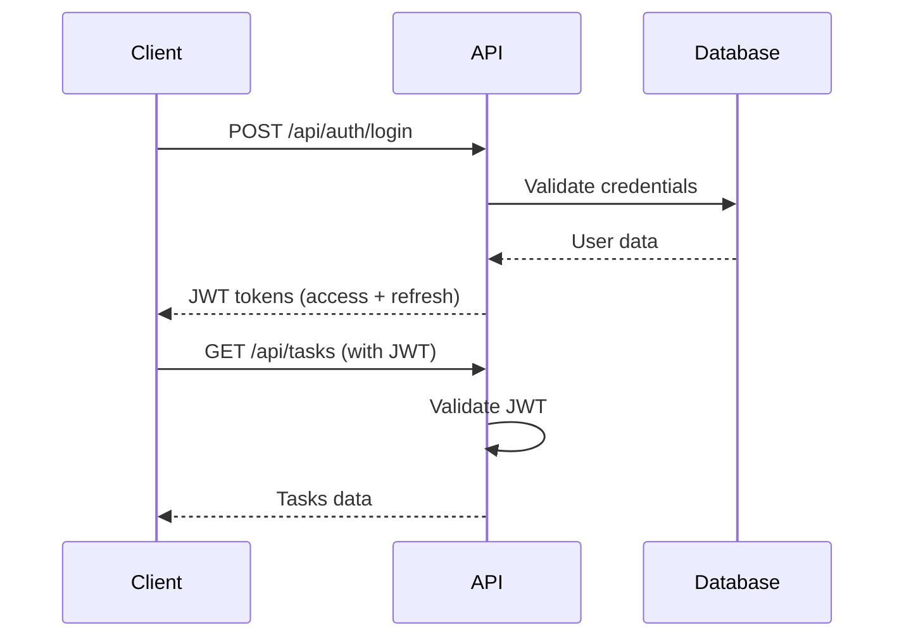

# 📚 API Documentation - Projektseite v3.0

> **Vollständige API-Dokumentation mit OpenAPI 3.0 Spezifikation**

## 📋 Inhaltsverzeichnis

- [API Overview](#api-overview)
- [Authentication](#authentication)
- [Error Handling](#error-handling)
- [Endpoints](#endpoints)
- [Data Models](#data-models)
- [Examples](#examples)
- [SDK & Client Libraries](#sdk--client-libraries)

## 🌐 API Overview

### Base URL

```
Development:  http://localhost:3001/api
Staging:      https://staging.projektseite.de/api
Production:   https://projektseite.de/api
```

### API Version

- **Current Version**: v3.0.0
- **Version Header**: `API-Version: 3.0.0`
- **Deprecation Policy**: 6 months notice for breaking changes

### Content Types

- **Request**: `application/json`
- **Response**: `application/json`
- **File Upload**: `multipart/form-data`

## 🔐 Authentication

### JWT Authentication

Alle API-Endpunkte (außer Auth-Endpunkte) erfordern JWT-Authentifizierung.

```http
Authorization: Bearer <jwt_token>
```

### Authentication Flow



### Token Types

| Token Type | Expiration | Usage |
|------------|------------|-------|
| Access Token | 24 hours | API requests |
| Refresh Token | 7 days | Token renewal |

### Login Request

```http
POST /api/auth/login
Content-Type: application/json

{
  "username": "admin",
  "password": "admin123"
}
```

### Login Response

```json
{
  "success": true,
  "data": {
    "user": {
      "id": "user_123",
      "username": "admin",
      "email": "admin@projektseite.de",
      "role": "ADMIN"
    },
    "accessToken": "eyJhbGciOiJIUzI1NiIsInR5cCI6IkpXVCJ9...",
    "refreshToken": "eyJhbGciOiJIUzI1NiIsInR5cCI6IkpXVCJ9..."
  },
  "meta": {
    "timestamp": "2024-01-01T12:00:00.000Z",
    "requestId": "req_1234567890_abc123"
  }
}
```

## ⚠️ Error Handling

### Error Response Format

```json
{
  "success": false,
  "error": {
    "code": "VALIDATION_ERROR",
    "message": "Request validation failed",
    "details": [
      {
        "path": "email",
        "message": "Invalid email format"
      }
    ]
  },
  "meta": {
    "timestamp": "2024-01-01T12:00:00.000Z",
    "requestId": "req_1234567890_abc123"
  }
}
```

### HTTP Status Codes

| Code | Status | Description |
|------|--------|-------------|
| 200 | OK | Request successful |
| 201 | Created | Resource created |
| 400 | Bad Request | Invalid request data |
| 401 | Unauthorized | Authentication required |
| 403 | Forbidden | Insufficient permissions |
| 404 | Not Found | Resource not found |
| 409 | Conflict | Resource conflict |
| 422 | Unprocessable Entity | Validation error |
| 429 | Too Many Requests | Rate limit exceeded |
| 500 | Internal Server Error | Server error |

### Error Codes

| Code | Description |
|------|-------------|
| `VALIDATION_ERROR` | Request validation failed |
| `UNAUTHORIZED` | Authentication required |
| `FORBIDDEN` | Access denied |
| `NOT_FOUND` | Resource not found |
| `CONFLICT` | Resource already exists |
| `RATE_LIMIT_EXCEEDED` | Too many requests |
| `INTERNAL_ERROR` | Internal server error |

## 🛠️ Endpoints

### Authentication Endpoints

#### POST /api/auth/login

Authenticate user and return JWT tokens.

**Request:**
```json
{
  "username": "string",
  "password": "string"
}
```

**Response:**
```json
{
  "success": true,
  "data": {
    "user": "User",
    "accessToken": "string",
    "refreshToken": "string"
  }
}
```

#### POST /api/auth/register

Register new user account.

**Request:**
```json
{
  "username": "string",
  "email": "string",
  "password": "string",
  "role": "USER"
}
```

#### POST /api/auth/refresh

Refresh access token using refresh token.

**Request:**
```json
{
  "refreshToken": "string"
}
```

#### GET /api/auth/me

Get current user information.

**Headers:**
```
Authorization: Bearer <token>
```

**Response:**
```json
{
  "success": true,
  "data": {
    "id": "string",
    "username": "string",
    "email": "string",
    "role": "ADMIN",
    "isActive": true,
    "createdAt": "2024-01-01T12:00:00.000Z"
  }
}
```

### Task Endpoints

#### GET /api/tasks

Get tasks with filtering and pagination.

**Query Parameters:**
- `page` (number): Page number (default: 1)
- `limit` (number): Items per page (default: 20)
- `status` (array): Filter by status
- `priority` (array): Filter by priority
- `assigneeId` (string): Filter by assignee
- `projectId` (string): Filter by project
- `search` (string): Search in title/description

**Example:**
```http
GET /api/tasks?page=1&limit=10&status=TODO,IN_PROGRESS&priority=HIGH
```

**Response:**
```json
{
  "success": true,
  "data": [
    {
      "id": "task_123",
      "title": "Implement user authentication",
      "description": "Add JWT-based authentication system",
      "status": "IN_PROGRESS",
      "priority": "HIGH",
      "assigneeId": "user_456",
      "projectId": "project_789",
      "dueDate": "2024-01-15T00:00:00.000Z",
      "createdAt": "2024-01-01T12:00:00.000Z",
      "updatedAt": "2024-01-01T12:00:00.000Z"
    }
  ],
  "pagination": {
    "page": 1,
    "limit": 10,
    "total": 25,
    "totalPages": 3,
    "hasNext": true,
    "hasPrev": false
  }
}
```

#### POST /api/tasks

Create new task.

**Request:**
```json
{
  "title": "string",
  "description": "string",
  "priority": "MEDIUM",
  "assigneeId": "string",
  "projectId": "string",
  "dueDate": "2024-01-15T00:00:00.000Z",
  "estimatedHours": 8
}
```

#### GET /api/tasks/:id

Get task by ID.

**Response:**
```json
{
  "success": true,
  "data": {
    "id": "task_123",
    "title": "Implement user authentication",
    "description": "Add JWT-based authentication system",
    "status": "IN_PROGRESS",
    "priority": "HIGH",
    "assignee": {
      "id": "user_456",
      "username": "developer",
      "email": "dev@projektseite.de"
    },
    "project": {
      "id": "project_789",
      "name": "Authentication System"
    },
    "dueDate": "2024-01-15T00:00:00.000Z",
    "estimatedHours": 8,
    "actualHours": 4,
    "createdAt": "2024-01-01T12:00:00.000Z",
    "updatedAt": "2024-01-01T12:00:00.000Z"
  }
}
```

#### PATCH /api/tasks/:id

Update task.

**Request:**
```json
{
  "title": "string",
  "status": "COMPLETED",
  "priority": "HIGH",
  "actualHours": 10
}
```

#### DELETE /api/tasks/:id

Delete task.

**Response:**
```json
{
  "success": true,
  "data": {
    "id": "task_123",
    "deleted": true
  }
}
```

### Project Endpoints

#### GET /api/projects

Get projects with filtering and pagination.

**Query Parameters:**
- `page` (number): Page number
- `limit` (number): Items per page
- `status` (array): Filter by status
- `priority` (array): Filter by priority
- `visibility` (array): Filter by visibility
- `search` (string): Search in name/description

#### POST /api/projects

Create new project.

**Request:**
```json
{
  "name": "string",
  "description": "string",
  "priority": "MEDIUM",
  "teamId": "string",
  "visibility": "TEAM",
  "startDate": "2024-01-01T00:00:00.000Z",
  "targetDate": "2024-06-30T00:00:00.000Z"
}
```

#### GET /api/projects/:id

Get project by ID with related data.

**Response:**
```json
{
  "success": true,
  "data": {
    "id": "project_123",
    "name": "Authentication System",
    "description": "Implement JWT-based authentication",
    "status": "ACTIVE",
    "priority": "HIGH",
    "owner": {
      "id": "user_456",
      "username": "admin",
      "email": "admin@projektseite.de"
    },
    "team": {
      "id": "team_789",
      "name": "Development Team"
    },
    "visibility": "TEAM",
    "startDate": "2024-01-01T00:00:00.000Z",
    "targetDate": "2024-06-30T00:00:00.000Z",
    "completionPercentage": 75,
    "tasks": [
      {
        "id": "task_123",
        "title": "Implement login endpoint",
        "status": "COMPLETED"
      }
    ],
    "modules": [
      {
        "id": "module_123",
        "name": "Backend API",
        "status": "IN_PROGRESS"
      }
    ],
    "createdAt": "2024-01-01T12:00:00.000Z",
    "updatedAt": "2024-01-01T12:00:00.000Z"
  }
}
```

### Admin Endpoints

#### GET /api/admin/health

Get system health status.

**Response:**
```json
{
  "success": true,
  "data": {
    "status": "OK",
    "timestamp": "2024-01-01T12:00:00.000Z",
    "version": "3.0.0",
    "environment": "production",
    "uptime": 86400,
    "memory": {
      "used": 256,
      "total": 1024,
      "percentage": 25
    },
    "database": {
      "ok": true,
      "latency": 15,
      "connectionCount": 5
    },
    "services": {
      "database": true,
      "storage": true,
      "email": true
    }
  }
}
```

#### GET /api/admin/db/status

Get database status and performance metrics.

#### GET /api/admin/db/tables

Get database table information.

#### POST /api/admin/api-debug

Debug API calls (Admin only).

**Request:**
```json
{
  "method": "GET",
  "path": "/api/tasks",
  "headers": {
    "Authorization": "Bearer token"
  }
}
```

#### GET /api/admin/users

Get all users with filtering (Admin only).

#### PATCH /api/admin/users/:id/status

Update user status (Admin only).

**Request:**
```json
{
  "isActive": false
}
```

## 📊 Data Models

### User Model

```typescript
interface User {
  id: string;
  username: string;
  email: string;
  role: 'ADMIN' | 'USER' | 'VIEWER';
  isActive: boolean;
  createdAt: Date;
  updatedAt: Date;
  lastLoginAt?: Date;
}
```

### Task Model

```typescript
interface Task {
  id: string;
  title: string;
  description?: string;
  status: 'TODO' | 'IN_PROGRESS' | 'REVIEW' | 'COMPLETED' | 'CANCELLED';
  priority: 'LOW' | 'MEDIUM' | 'HIGH' | 'CRITICAL';
  assigneeId?: string;
  projectId?: string;
  moduleId?: string;
  createdById: string;
  dueDate?: Date;
  estimatedHours?: number;
  actualHours?: number;
  tags?: string[];
  createdAt: Date;
  updatedAt: Date;
  completedAt?: Date;
}
```

### Project Model

```typescript
interface Project {
  id: string;
  name: string;
  description?: string;
  status: 'PLANNING' | 'ACTIVE' | 'ON_HOLD' | 'COMPLETED' | 'CANCELLED';
  priority: 'LOW' | 'MEDIUM' | 'HIGH' | 'CRITICAL';
  ownerId: string;
  teamId?: string;
  visibility: 'PRIVATE' | 'TEAM' | 'PUBLIC';
  startDate?: Date;
  targetDate?: Date;
  completionPercentage: number;
  createdAt: Date;
  updatedAt: Date;
}
```

### Team Model

```typescript
interface Team {
  id: string;
  name: string;
  description?: string;
  leaderId: string;
  isActive: boolean;
  createdAt: Date;
  updatedAt: Date;
}
```

### Module Model

```typescript
interface Module {
  id: string;
  projectId: string;
  name: string;
  description?: string;
  status: 'NOT_STARTED' | 'IN_PROGRESS' | 'TESTING' | 'COMPLETED';
  priority: 'LOW' | 'MEDIUM' | 'HIGH' | 'CRITICAL';
  assignedTo?: string;
  dueDate?: Date;
  estimatedHours?: number;
  actualHours?: number;
  completionPercentage: number;
  createdAt: Date;
  updatedAt: Date;
}
```

## 💡 Examples

### Complete Task Workflow

```bash
# 1. Login
curl -X POST http://localhost:3001/api/auth/login \
  -H "Content-Type: application/json" \
  -d '{"username":"admin","password":"admin123"}'

# 2. Create Task
curl -X POST http://localhost:3001/api/tasks \
  -H "Content-Type: application/json" \
  -H "Authorization: Bearer <token>" \
  -d '{
    "title": "Implement user authentication",
    "description": "Add JWT-based authentication system",
    "priority": "HIGH",
    "dueDate": "2024-01-15T00:00:00.000Z",
    "estimatedHours": 8
  }'

# 3. Update Task Status
curl -X PATCH http://localhost:3001/api/tasks/task_123 \
  -H "Content-Type: application/json" \
  -H "Authorization: Bearer <token>" \
  -d '{"status": "IN_PROGRESS"}'

# 4. Complete Task
curl -X PATCH http://localhost:3001/api/tasks/task_123 \
  -H "Content-Type: application/json" \
  -H "Authorization: Bearer <token>" \
  -d '{
    "status": "COMPLETED",
    "actualHours": 10
  }'
```

### Project Management Workflow

```bash
# 1. Create Project
curl -X POST http://localhost:3001/api/projects \
  -H "Content-Type: application/json" \
  -H "Authorization: Bearer <token>" \
  -d '{
    "name": "Authentication System",
    "description": "Implement JWT-based authentication",
    "priority": "HIGH",
    "visibility": "TEAM",
    "targetDate": "2024-06-30T00:00:00.000Z"
  }'

# 2. Get Project with Tasks
curl -X GET http://localhost:3001/api/projects/project_123 \
  -H "Authorization: Bearer <token>"

# 3. Update Project Status
curl -X PATCH http://localhost:3001/api/projects/project_123 \
  -H "Content-Type: application/json" \
  -H "Authorization: Bearer <token>" \
  -d '{"status": "ACTIVE"}'
```

### Admin Operations

```bash
# 1. Check System Health
curl -X GET http://localhost:3001/api/admin/health \
  -H "Authorization: Bearer <admin_token>"

# 2. Get Database Status
curl -X GET http://localhost:3001/api/admin/db/status \
  -H "Authorization: Bearer <admin_token>"

# 3. Get All Users
curl -X GET http://localhost:3001/api/admin/users?page=1&limit=20 \
  -H "Authorization: Bearer <admin_token>"

# 4. Update User Status
curl -X PATCH http://localhost:3001/api/admin/users/user_123/status \
  -H "Content-Type: application/json" \
  -H "Authorization: Bearer <admin_token>" \
  -d '{"isActive": false}'
```

## 🔧 SDK & Client Libraries

### JavaScript/TypeScript SDK

```typescript
import { ProjektseiteAPI } from '@projektseite/api-client';

const api = new ProjektseiteAPI({
  baseURL: 'https://projektseite.de/api',
  apiKey: 'your-api-key'
});

// Login
const auth = await api.auth.login({
  username: 'admin',
  password: 'admin123'
});

// Set token
api.setToken(auth.accessToken);

// Get tasks
const tasks = await api.tasks.list({
  page: 1,
  limit: 20,
  status: ['TODO', 'IN_PROGRESS']
});

// Create task
const task = await api.tasks.create({
  title: 'New Task',
  description: 'Task description',
  priority: 'HIGH'
});
```

### Python SDK

```python
from projektseite import ProjektseiteAPI

api = ProjektseiteAPI(
    base_url='https://projektseite.de/api',
    api_key='your-api-key'
)

# Login
auth = api.auth.login(
    username='admin',
    password='admin123'
)

# Set token
api.set_token(auth['accessToken'])

# Get tasks
tasks = api.tasks.list(
    page=1,
    limit=20,
    status=['TODO', 'IN_PROGRESS']
)

# Create task
task = api.tasks.create(
    title='New Task',
    description='Task description',
    priority='HIGH'
)
```

### cURL Examples

```bash
# Authentication
export TOKEN=$(curl -s -X POST http://localhost:3001/api/auth/login \
  -H "Content-Type: application/json" \
  -d '{"username":"admin","password":"admin123"}' | \
  jq -r '.data.accessToken')

# API Calls
curl -H "Authorization: Bearer $TOKEN" \
  http://localhost:3001/api/tasks

curl -H "Authorization: Bearer $TOKEN" \
  http://localhost:3001/api/projects
```

## 📈 Rate Limiting

### Rate Limits

| Endpoint | Limit | Window |
|----------|-------|--------|
| Auth endpoints | 5 requests | 15 minutes |
| API endpoints | 100 requests | 15 minutes |
| Admin endpoints | 50 requests | 15 minutes |
| API Debug | 10 requests | 5 minutes |

### Rate Limit Headers

```http
X-RateLimit-Limit: 100
X-RateLimit-Remaining: 95
X-RateLimit-Reset: 1640995200
```

### Rate Limit Response

```json
{
  "success": false,
  "error": {
    "code": "RATE_LIMIT_EXCEEDED",
    "message": "Too many requests. Please wait a moment."
  }
}
```

## 🔍 OpenAPI Specification

Die vollständige OpenAPI 3.0 Spezifikation ist verfügbar unter:

- **Development**: http://localhost:3001/api/docs
- **Staging**: https://staging.projektseite.de/api/docs
- **Production**: https://projektseite.de/api/docs

### Interactive API Explorer

Verwende den integrierten Swagger UI für interaktive API-Tests:

1. Öffne die API-Dokumentation
2. Klicke auf "Authorize" und gib deinen JWT-Token ein
3. Teste die Endpunkte direkt im Browser

---

**Projektseite v3.0** - Complete API Documentation

📚 **Weitere Dokumentation:**
- [Deployment Guide](DEPLOYMENT.md)
- [Architecture Overview](ARCHITECTURE.md)
- [Security Guide](SECURITY.md)
